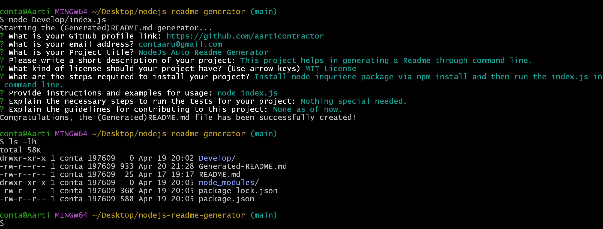

# nodejs-readme-generator

## Description

[Visit the Deployed Site](https://www.youtube.com/watch?v=CUbl4zB6VOM)
<br>

 Given a command-line application that accepts user input, when the user is prompted for information about my application repository then, a high-quality, professional README.md is generated with the title of their project and sections entitled Description, Table of Contents, Installation, Usage, License, Contributing, Tests, and Questions

When the user enters a description, installation instructions, usage information, contribution guidelines, and test instructions, then this information is added to the sections of the README entitled Description, Installation, Usage, Contributing, and Tests
If a user chooses a license for their application from a list of options, a badge for that license is added near the top of the README and a notice is added to the section of the README entitled License that explains which license the application is covered under
When the user enters their  GitHub username and email address, they are added to the section of the README entitled Questions, with a link to their GitHub profile

<br>
<br>


## Technology Used 

| Technology Used         | Resource URL           | 
| ------------- |:-------------:| 
| HTML    | [https://developer.mozilla.org/en-US/docs/Web/HTML](https://developer.mozilla.org/en-US/docs/Web/HTML) | 
| CSS     | [https://developer.mozilla.org/en-US/docs/Web/CSS](https://developer.mozilla.org/en-US/docs/Web/CSS)      |   
| Git | [https://git-scm.com/](https://git-scm.com/)     |  
| JavaScript | [https://developer.mozilla.org/en-US/docs/Web/JavaScript](https://developer.mozilla.org/en-US/docs/Web/JavaScript) |  
| NodeJs | [https://nodejs.org/en](https://nodejs.org/en) |


<br>


## Table of Contents

* [Application Highlights and Usage](#application-highlights-and-usage)
* [Code Snippets](#code-snippets)
* [Note](#note)
* [Learning Points](#learning-points)
* [Author Info](#author-info)
* [Credits](#credits)

<br>


## Application Highlights and Usage
<br>

Below is the image of how the inquirer prompt works when lodged in the command line: 
<br>
<br>




<br>


## Code Snippets

<br>

The following code snippet shows the function which makes use of the switch case statement method to render/return a license link in the generated readme:

```javascript

function renderLicenseLink(license) {
  switch (license) {
      case "MIT License":
          return "(https://opensource.org/licenses/MIT)";
      case "Apache License 2.0":
          return "(https://opensource.org/licenses/Apache-2.0)";
      case "GNU General Puplic License v3.0":
          return "(https://www.gnu.org/licenses/gpl-3.0)";
      case "Mozilla Public License 2.0":
          return "(https://opensource.org/licenses/MPL-2.0)";
      case "None":
          return "";
      default:
          return "";

  }
}

```

<br>
<br>


The below snippet shows the function which writes to the new generated readme file when run in the command line:

```javascript

function writeToFile(fileName, data) {
    fs.writeFile(fileName, data, function(err) {
        if (err) {
            return console.log(err);
        }
        console.log("Congratulations, the (Generated)README.md file has been successfully created!");
    });
}

```

<br>
<br>


# Note

Click on the below link to view an example of the Generated Readme file:
<br>
[Link Text](Generated-README.md)

<br>
<br>

## Learning Points 

   I learned the following skills while doing this project:
<br>
- Java script basics (variables,functions, arrays, for-loops, if-else etc)
- How to create a redme file using the command line
- Basics of NodeJs server and related functions
- How to write switch case statements and fs.writefile functions
- Using the let and const variables

<br>
<br>

## Author Info

### Aarti Contractor


- Portfolio: https://aarticontractor.github.io/aarticontractor_portfolio/
- Linkedin: https://www.linkedin.com/in/aarti-contractor/
- Github: https://github.com/aarticontractor

<br>

## Credits

- https://getbootstrap.com/
- https://developer.mozilla.org/en-US/docs/Web/JavaScript
- https://beautifier.io/
- https://onecompiler.com/javascript/3z45t4b2m
- https://cloudconvert.com/webm-to-gif
- https://nodejs.org/en
- https://www.npmjs.com/package/inquirer


<br>

© 2023 edX Boot Camps LLC. Confidential and Proprietary. All Rights Reserved.